# PiTutorial

* Raspberry Pi tutorial for beginners.
* based on 
  * https://learn.adafruit.com/series/learn-raspberry-pi (original tutorial)
  * https://github.com/zhangshuo951227/raspberry-pi/wiki (updated for Jessie)
  * 2017 Summer Short Course 

---
# Lab 326 settings
* During the lab, you will work as a group of 2 (or 3) members. 
* Seat arrangement 
    * **Odd** number: PC (do not remove anything from it). You will need this to google solutions for any troubles you may have. 
    * **Even** number: Raspberry Pi 
        * Do not remove keyboard or mouse from the PC. Extra keyboards and mouses are provided during the lab.
        * You're recommended to use WiFi to connect you RPI to the internet. But, if you need wired connection with static IP, you may use the ethernet cable from your PC. When you're done, please put it back to the PC. 
        * Connect HDMI cable to your RPI and the display. Then, don't forget to change the input of your display to HDMI.
        * **AFTER YOU'RE DONE. PUT EVERYTHING BACK!**    
* We have WiFis for Raspberry Pi in 326 (during the lab) and 413 (24h). Access info is as follows. 
    * 326 (during the lab)
        * SSID/pw: RPI_5G / raspberrypi
        * SSID/pw: RPI / raspberrypi
    * 413
        * Register and get access info from [here](http://smart.inu.ac.kr/eecs/).
* **NO FOOD IN THE LAB!**
    * If you bring any food, your grade goes down by one level.
    * NO SNACK! NO COFFEE! NO JUICE! NO TEE!
    * The only exception is water WITH A CAP. 

# Lab 1. Intro to RPI
## Pre-lab Questions
```
Q. What is Raspberry Pi? 
Q. What is it good for? 
Q. What do you want to make using Raspberry Pi?
```

## Installation!

1. Attach heat sinks
    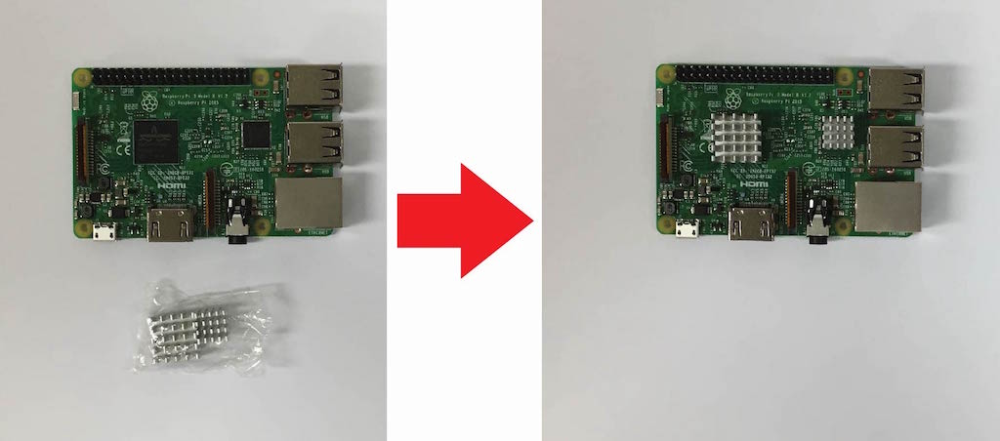

2. Make Raspbian micro SD image
    * follow steps in https://learn.adafruit.com/adafruit-raspberry-pi-lesson-1-preparing-and-sd-card-for-your-raspberry-pi
    * You can download latest Raspbian image from https://www.raspberrypi.org/downloads/raspbian/ or from our e-larning system (week 2).
        * RASPBIAN STRETCH LITE: CLI only, preferred 
        * RASPBIAN STRETCH WITH DESKTOP: GUI included, but slow
        * Version: September 2017, Release date:2017-09-07, Kernel version:4.9
    * Insert the micro SD card to the slot in the back.
        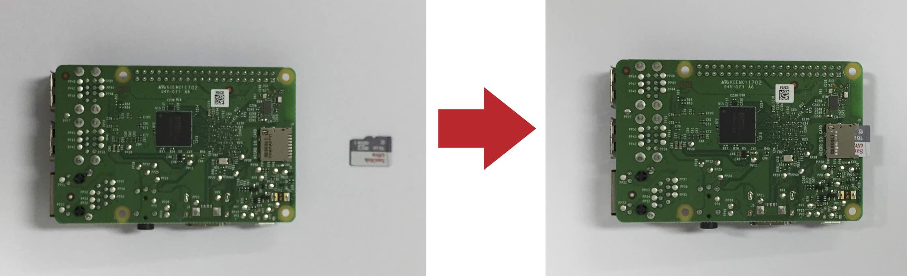
    * Connect the power, monitor (through HDMI), keyboard (through USB) to your RPI. Then, you will see four raspberries and many booting logs on your screen.
        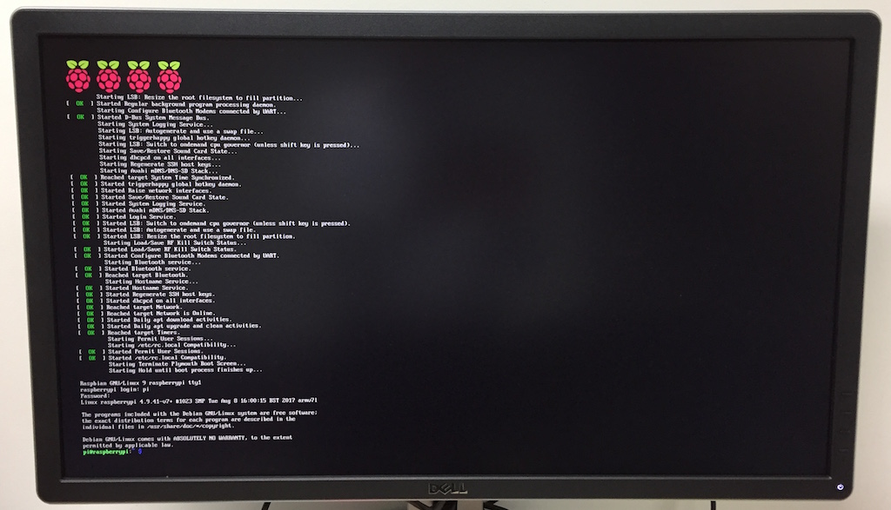
    * Log in with default id/pw
        * id: pi
        * pwd: raspberry

3. Configuring your RPI
    * Change password!
        ```bash
        passwd
        ```
        Account "pi" is an administrator. So, it's very important to use a strong password to secure you system. 

        It's also a good idea to make a new id that you like and make it an administrator. You can do it as follows.
        ```bash
        sudo adduser [ID YOU WANT]
        sudo adduser [ID YOU WANT] sudo
        ```
        
        Here, "sudo" is a special command (only for administrators) to change or set critical settings. Any sudo command requires authentification based on the password of the current your.
        
        System-critical operations can be done only by sudoers.
        
        For example, you can reboot with this command:
        ```bash
        sudo reboot
        ```
        
        You can shutdown the system with:
        ```bash
        sudo shutdown -h now
        ```
        It's a good idea to shutdown before you unplug the power. 
        
        
    * Using raspi-config
        In RPI, you can change any setting you like using command line commands. 
        There is an easier way. Execute: 
        ```bash
        sudo raspi-config
        ```
        You will see a menu for some common settings.
        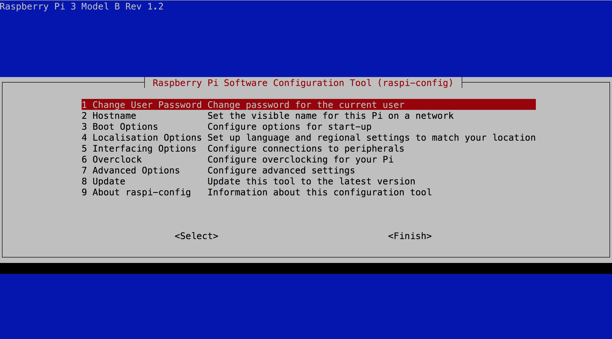
        
    * Enable SSH
    
        SSH is the standard way to connect any Linux-based machine. Using ssh, you can remotely connect to your RPI. So, let's turn it on.
        
        Run "raspi-config" and select "5 Interfacing Options" > "P2 SSH". Then, you can enable SSH.
        ```bash
        sudo raspi-config
        ```        
        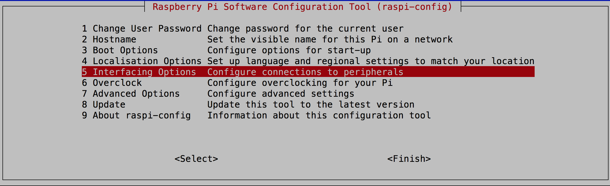
        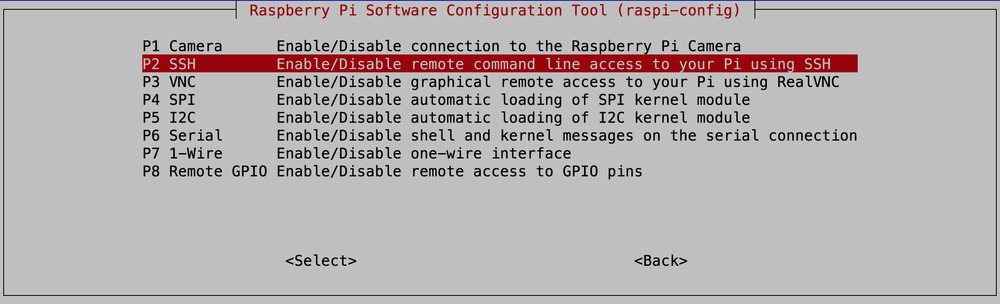

    * Change locale
    
        By default, RPI is set up for British English and British keyboards. The former may not a big problem, but the latter is. With default setting, you may not type special characters like " or #!
        So, let's change the locale using raspi-config. 
        
        Run "raspi-config" and select "4 Localization Options" > "I1 Change Locale"
        ```bash
        sudo raspi-config
        ```        
        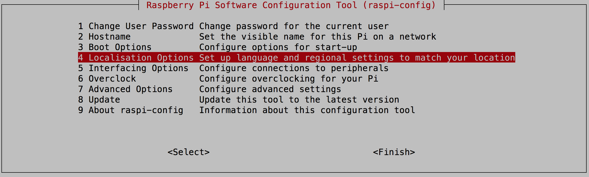
        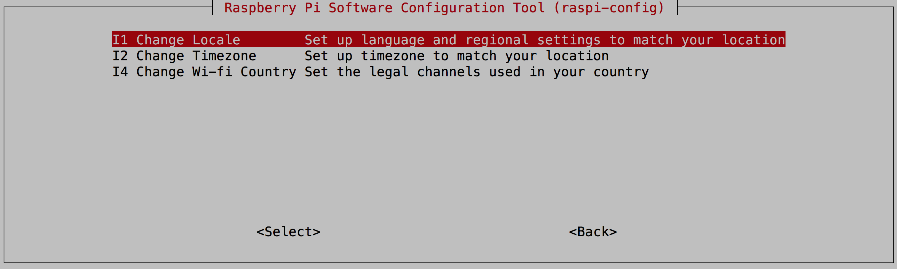        
        
        Here, uncheck anything starting with "en_GB" and check "en_US.UTF-8 UTF-8."
        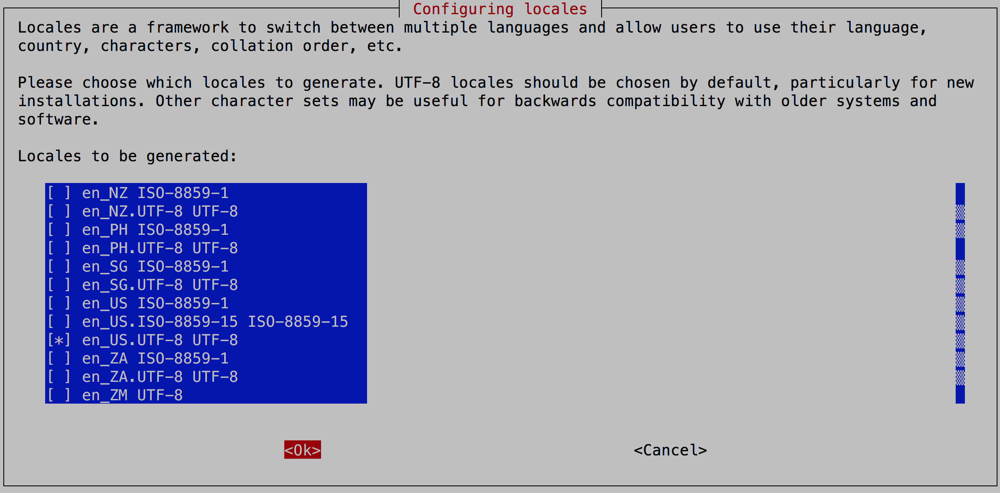
        
        Set also default locale to "en_US.UTF-8 UTF-8." Then, wait for a while.
        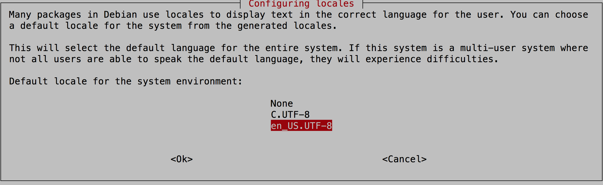

    
        ```bash
        sudo reboot
        ```    

    * Change keyboard layout
    
        Run "raspi-config" and select "4 Localization Options"> "I3 Change Keyboard layout". 
        Select "Generic 102-key", "English(US)", and default for the others. Then reboot.
        ```bash
        sudo raspi-config
        ```
        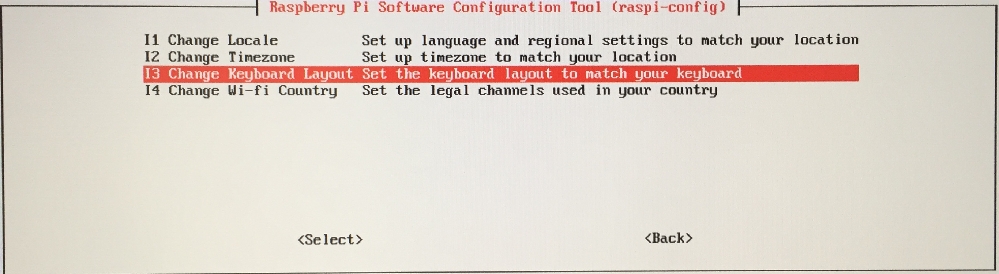
        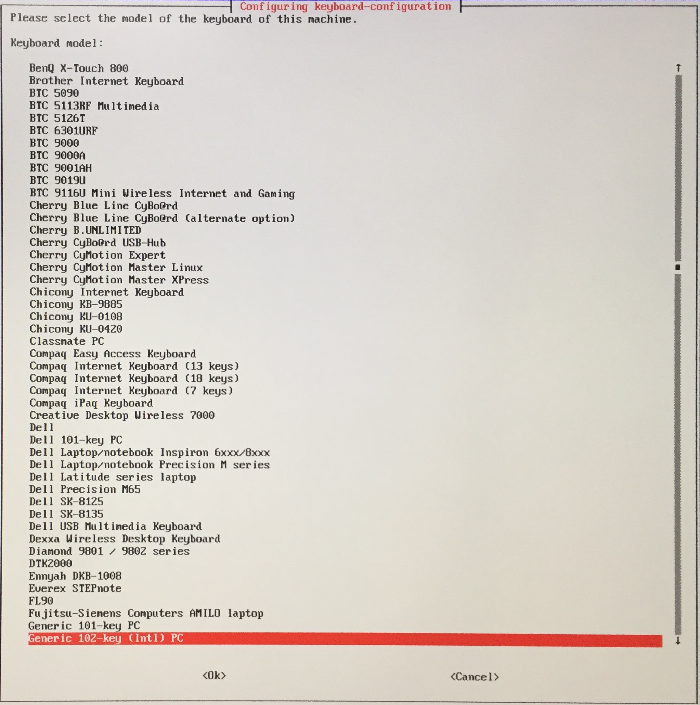
        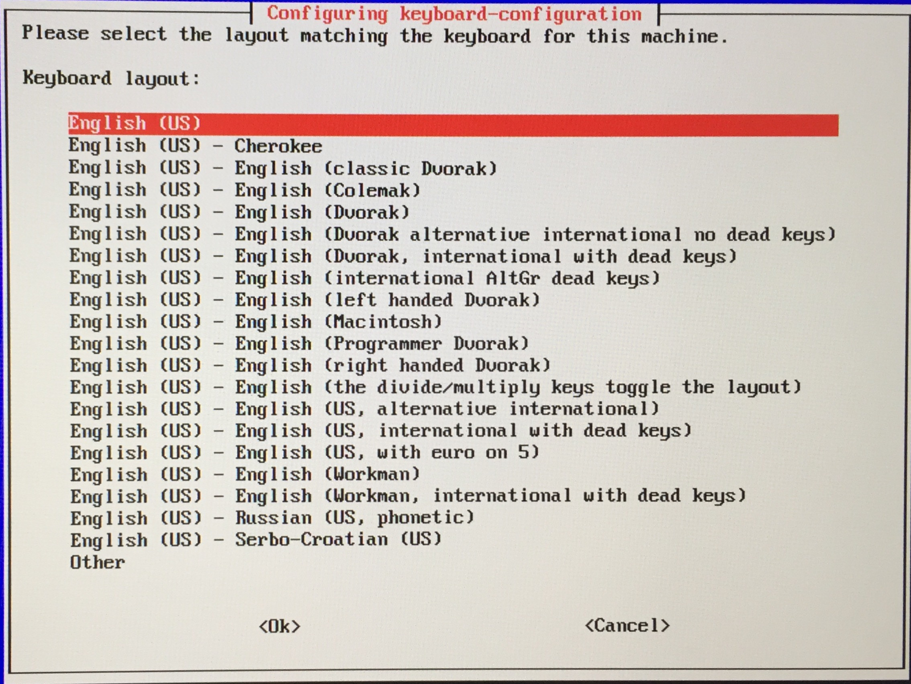
        ```bash
        sudo reboot
        ```

    * For other settings, see https://learn.adafruit.com/adafruits-raspberry-pi-lesson-2-first-time-configuration
    
4. Network setup 
    * Because this is an "IoT" class, we will use WiFi.
    * But, unfortunately, the built-in WiFi has a serious compatibility issues with many WiFi APs. See [here](http://forums.rasplay.org/topic/196/공지-raspberrypi-model-3b-wifi-issue) for more detail.
    * You have two solutions
        * Replace WiFI AP (which I did for rooms 326 and 413)
        * Add another WiFi dongle 
    * In room 326, you can setup as follows to access the WiFi.
    
        **ADD** the following lines at the end of /etc/wpa_supplicant/wpa_supplicant.conf. (**DO NOT CHANGE THE FIRST THREE LINES!**)
        ```
        network={
        ssid="RPI_5G"
        psk="raspberrypi"
        priority=1
        }
        network={
        ssid="RPI"
        psk="raspberrypi"
        priority=2
        }
        ```

        Then, reboot.

        ```bash
        sudo reboot
        ```

## Play with RPI
1. Change your hostname.

Hint: use "raspi-config" command

2. Change timezone.

Hint: use "raspi-config" command and see inside of localization options

3. Remotely connect your RPI using SSH.

4. Update your RPI

```bash
sudo apt-get update
sudo apt-get upgrade
```

---

# Git 

Git is the SW engineer's best friend!
Git is a modern version control system, which is an essential platform for SW development.
Github offers repositories for git and web-based tools for free!
Most open-source softwares are hosted on github, which became a de-facto reposotiry for collaborating and sharing your codes with the global community.
This week, you will learn how to use git and open an account on github.
From now on, all the codes will be submitted through github.com

## Online tutorial 
 * Beginner's guide: https://opentutorials.org/course/1492
 * (Optional) For advanced topics: https://opentutorials.org/course/2708
 * Markdown cheatsheet: https://github.com/adam-p/markdown-here/wiki/Markdown-Cheatsheet
 
## Exercise
  * Install git on your system. 
  
    On Ubuntu, you can install git using apt-get:
       ```bash
       sudo apt-get install git
       ```

    On OSX, first install [Macport](https://www.macports.org/install.php) and then install git:
       ```bash
       sudo port install git
       ```

    On MS Windows, install "git for windows". Here is a [guideline](https://github.com/ys7yoo/PiTutorial/blob/master/git%20for%20windows.md). 
       
  * Open an account on github.com.
  * Make a homepage linked to your github id on [YOUR-ID].github.io. (See https://pages.github.com for steps.)
  * Make a repository for your individual lab codes. Make a README.md with descrptions about your codes.
  * Make a repository for your team project. Make a README.md with descrptions about your codes.
  


# [Demo] Lab 1 and Git 
 Bring your RPI to the front and show us the following.

1. WiFi setup 
   In the terminal, 
   1) show /etc/wpa_supplicant/wpa_supplicant.conf using a text editor. 
   2) check connection to the AP.
       ```
       ping 192.168.0.1
       ```

   3) check connection to an external website. 
       ```
       ping www.google.com
       ```
       
2. Git

    1) Clone a remote repository in your GitHub to your RPI

    2) Make some changes.

    3) Commit the change to the local repository

    4) Push the change to the remote repository (GitHub)
    
---

# Lab 2. Python crash course

## Pre-lab Questions
1. Why Python?

   Read an article [here](https://stackoverflow.blog/2017/09/06/incredible-growth-python/) about Python.
   Summarize why Python is so popular these days.

2. Set up Python development environment in your PC

   You can follow a quick tutorial in https://github.com/ys7yoo/PyBasic#1-setting-up-python-environment.
   
3. Review git commands (clone, commit, push, pull)


## Working with git!

We will actively use git in our labs. 

Today, we will make full use of **1 PC + 1 RPI** setup in room 326.
As shown in the following figure, your will write a python code on the desktop and play with it. When you're sure that your code is ready, push your code to github repository. You will "pull" the code from the repository to your RPI. Then, your can run it on your RPI.
    
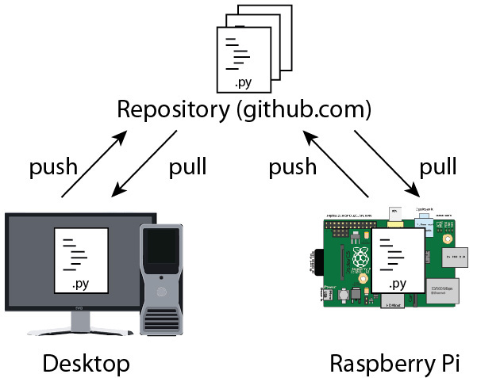
    
### Step 1. Make a repository on github.com that you want to share with your teammate.

1. Go to [github.com](https://github.com) and log in. 

2. Click "New repository" button to create a new one. 

3. Create a README.md file!

4. Add your teammate as a collaborator of the repository

   In the repository you made, you can add a collaborator from "Settings" > " "Collaboratiors" menu.
   


### Step 2. Work on PC

0. Install Git for windows (or Source Tree)

1. Clone the repository to the desktop.

```bash
git clone [ADDRESS OF YOUR REPOSITORY]
cd [NAME OF THE REPOSITORY]
```

2. Add a python code to the folder.

You can add the file to the LOCAL reposibory by
```
git add [FILE NAME]
```


3. You can check your code in https://repl.it

4. When your code is ready, commit your work and push it to the REMOTE repository.

```bash
git commit [ANY CHANGE YOU MADE]
git push
```

5. Check that the change is applied to your github repository.


### Step 3. Test on RPI
1. First of all, you need to install git on your RPI.

```bash
sudo apt install git
```

2. Clone the repository to your RPI.

```bash
git clone [ADDRESS OF YOUR REPOSITORY]
cd [NAME OF THE REPOSITORY]
```

3. Run and make any change you want.

4. To submit changes you made to the REMOTE repository,

```bash
git commit [ANY CHANGE YOU MADE]
git push
```

## Python 3 programming

Now, let's start Python programming!

A list of key concepts about Python 3 is here: https://github.com/ys7yoo/PyBasic#2-python-3-programming.
Read each topic and run sample codes with your teammate. 

---

# Lab 3. GPIO

## Pre-lab Questions

Read the article on https://www.raspberrypi.org/documentation/usage/gpio-plus-and-raspi2/ and answer the following questions.

Q. What is GPIO?

Q. How does this electrical circuit work? (Explain what happens when the switch turns on or off.)
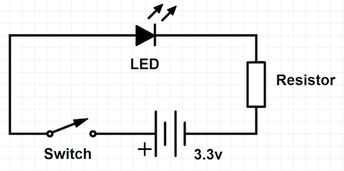

Read the article on https://playground.arduino.cc/CommonTopics/PullUpDownResistor and answer the following question

Q. How does the switch with the pull down register work? (Explain what happens when the switch turns on or off.)


## Overview
Today, we will make a thing that interact with the envorinment through GPIO.

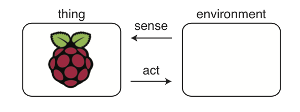

## Acting

We will start from a simple example of blinking an LED. 

GPIO pins of Raspberry Pi 3B: 


Install the GPIO package for Python 3. 

```bash
pip3 install rpi.gpio
```

Run the following Python Code.

```python
# import required libraries 
import RPi.GPIO as GPIO
import time

# set up the GPIO 18 for output
portNo = 12 # GPIO 18 is on physical port 12
GPIO.setmode(GPIO.BOARD)
GPIO.setup(portNo, GPIO.OUT)

# blink the LED
for i in range(3):
    GPIO.output(portNo,True)
    time.sleep(1)
    GPIO.output(portNo,False)
    time.sleep(1)

# clean up GPIO settings
GPIO.cleanup()
```

The code is in https://github.com/ys7yoo/PiTutorial/blob/master/src/led.py.
You may download and run it as follows.
```bash
wget https://github.com/ys7yoo/PiTutorial/blob/master/src/led.py
python3 led.py
```


## Sensing


