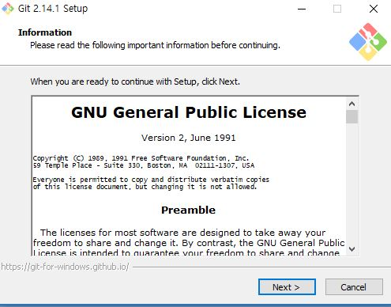
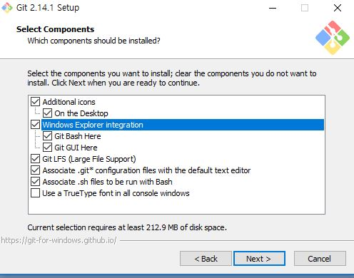
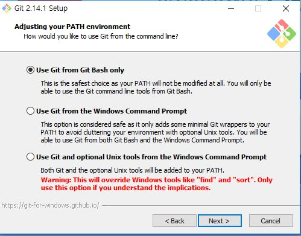
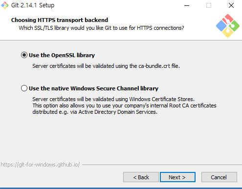
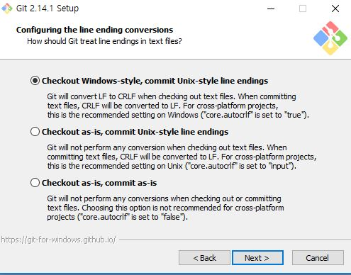
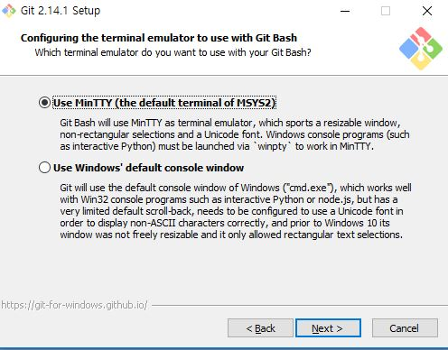
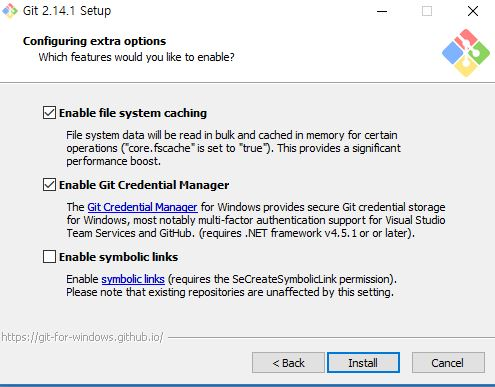

## Installing git for windows 


### Step 1. Get the latest version

Google "git for windows" 
or go to [https://git-for-windows.github.io](https://git-for-windows.github.io).

Click "Download" button.

Downloding Git-2.14.1-**64**-bit.exe or Git-2.14.1-**32**-bit.exe (depending on your system) should automatically start.

### Step 2. Installing & configuring 

Run the installer.

There are many options for detail settings. 
Recommended settings are as follows.

1. Check the license and click "Next" button.

    

2. Check "additional icons" and "Windows Explorer integration."

    
3. Choose "Use Git from Git-Bash only," which is the safest option!

    

4. Keep the default option.

    

5. Keep the default option.

    

6. Keep the default option.

    
    
7. Keep the default option and click "Install" button.

    


### Step 3. Using it

Launch "Git Bash."
Then you will see a bash CLI window like this.


Here, you can use the full-fledged Bash on windows!


For example, you can clone a repository:
```bash
git clone [ADDRESS OF REPOSITORY]
```

Move into the local repository:
```bash 
cd [NAME OF THE REPOSITORY]
```

Check status of the local repository:
```bash
git status
```

Commit changes you made in the local repository:
```bash
git commit [ANY CHANGE YOU WANT TO COMMIT]
```

Push all the commits to the remote repository.
```bash
git push
```

